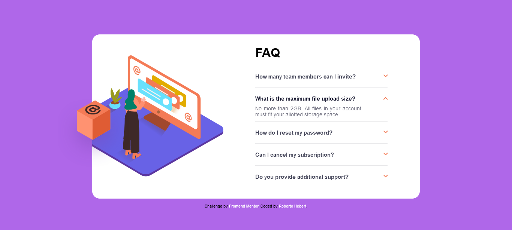

# Frontend Mentor - FAQ accordion card solution

This is a solution to the [FAQ accordion card challenge on Frontend Mentor](https://www.frontendmentor.io/challenges/faq-accordion-card-XlyjD0Oam). Frontend Mentor challenges help you improve your coding skills by building realistic projects. 

## Table of contents

- [Overview](#overview)
  - [The challenge](#the-challenge)
  - [Screenshot](#screenshot)
  - [Links](#links)
- [My process](#my-process)
  - [Built with](#built-with)
  - [What I learned](#what-i-learned)
  - [Continued development](#continued-development)
  - [Useful resources](#useful-resources)
- [Author](#author)
- [Acknowledgments](#acknowledgments)

## Overview

### The challenge

Users should be able to:

- View the optimal layout for the component depending on their device's screen size
- See hover states for all interactive elements on the page
- Hide/Show the answer to a question when the question is clicked

### Screenshot

### Links

- Solution URL: [Solution URL](https://www.frontendmentor.io/profile/hebertpxx)
- Live Site URL: [Live site URL](https://github.com/hebertpxx)

## My process

### Built with

- Semantic HTML5 markup
- CSS custom properties
- Flexbox

### What I learned

 While working through this project, my major learning was how to use the 
 and 
 tags and their properties.

### Continued development

I want to continue focusing on improving the use of flexbox , given that I am not yet completely comfortable with responsive layout techniques and that I need to refine my skills with such a concept. I also need to learn how to manipulate SVG.

### Useful resources

- [HTML Details Tag](https://www.w3schools.com/tags/tag_details.asp) - This helped me for XYZ reason. I really liked this content.

**Note: Delete this note and replace the list above with resources that helped you during the challenge. These could come in handy for anyone viewing your solution or for yourself when you look back on this project in the future.**

## Author

- Website - [Roberto Hebert](https://github.com/hebertpxx)
- Frontend Mentor - [@yourusername](https://www.frontendmentor.io/profile/hebertpxx)

## Acknowledgments

I would like to thank Fernando Leonid for the knowledge he taught about layout.
